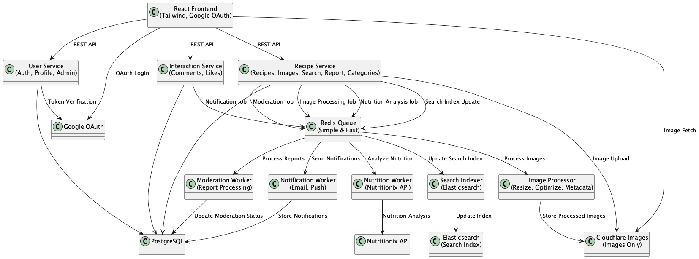
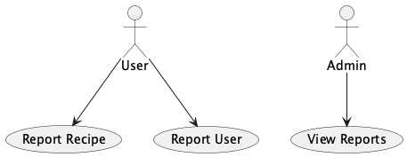

# GreenForked 🌱

A scalable, modern web application for vegan food lovers, bloggers, and the plant-based community. Users can upload, browse, like, and comment on vegan recipes, with a clean, mobile-friendly interface and robust backend.

## About This Project

This is a TDD Sandbox Project created as part of the Optivem Journal TDD in Legacy Code series by Valentina Jemuović. The goal is to practice TDD and Hexagonal Architecture in a safe, simulated environment before applying these practices to real-life projects.  
- [Optivem Journal](https://journal.optivem.com/)
- [Sandbox Project Dashboard](https://journal.optivem.com/p/sandbox-project-dashboard)

## Contributors
- Sharang Gupta ([GitHub](https://github.com/sharanggupta))

## License
MIT License – see [LICENSE](LICENSE)

## Project Board
- [GitHub Project Board](https://github.com/users/sharanggupta/projects/2)

## Use Cases
- Register/login with Google
- Create, edit, delete vegan recipes
- Browse, search, and filter recipes
- Like and comment on recipes
- User profiles with bio, image, social links
- Admin moderation (ban, warn, delete users/recipes)
- Report inappropriate recipes and users
- Category management (recipes can be organized and filtered by category; admins can manage the list of categories)
- Nutrition analysis (calorie calculation via Nutritionix API)

**Actors:** Visitor, User, Blogger, Admin  
**Use Case Diagrams:**
- [Authentication & User Management](diagrams/use-case-authentication.png)
- [Recipe Management](diagrams/use-case-recipe-management.png)
- [Social Features](diagrams/use-case-social-features.png)
- [Moderation & Reporting](diagrams/use-case-moderation.png)

## External Systems
- Google OAuth ([Google Identity](https://developers.google.com/identity)) – Authentication
- Cloudflare Images ([Cloudflare Images](https://www.cloudflare.com/products/images/)) – Media Storage
- Nutritionix API ([nutritionix.com](https://www.nutritionix.com/business/api)) – Nutrition analysis

## System Architecture Style
Frontend + Microservice Backend

## Tech Stack
- **Frontend:** React (TypeScript), Tailwind CSS
- **Backend:** Spring Boot (Java 17+), PostgreSQL, REST APIs
- **Media Storage:** Cloudflare Images
- **Nutrition Analysis:** Nutritionix API
- **Deployment:** Docker, Kubernetes, GitHub Actions

## Repository Strategy
Mono-repo (all components in one repository)

## Branching Strategy
Feature Branching

## Deployment Model
- Local (Docker Compose, Helm for Kubernetes)
- [UAT/Production planned for future]

## Component Repositories
- This is a mono-repo. All services and frontend are in this repository.

## Tickets
- User stories and tasks are tracked in the [Project Board](https://github.com/users/sharanggupta/projects/2).

## Environments
- Local (Docker Compose)
- [UAT/Production planned for future]

## Manual Deployment
See [Deployment Guide](docs/deployment/DEPLOYMENT_GUIDE.md)

## Manual Testing
See [Manual Test Procedure](docs/deployment/MANUAL_TEST_PROCEDURE.md)

## Documentation
- [Architecture Description](docs/architecture/ARCHITECTURE_DESCRIPTION.md)
- [Use Case Description](docs/architecture/USE_CASE_DESCRIPTION.md)
- [Deployment Guide](docs/deployment/DEPLOYMENT_GUIDE.md)
- [Manual Test Procedure](docs/deployment/MANUAL_TEST_PROCEDURE.md)

## Internal Project Demo
(Skipped for individual project)

---

## System Architecture

### Architecture Overview

### Microservices
- **User Service**: Handles authentication (Google OAuth), user registration, profile management, and admin actions
- **Recipe Service**: Manages recipe CRUD, image uploads, search/filter, reporting, nutrition, and category management (including creating, editing, deleting, and listing recipe categories for organizing and filtering recipes)
- **Interaction Service**: Manages comments and likes on recipes

---

## Use Case Diagrams

### Authentication & User Management

### Recipe Management

### Social Features

### Moderation & Reporting

---

## Data Model

### Entity Relationship Diagram

---

*Built with ❤️ by the GreenForked community* 