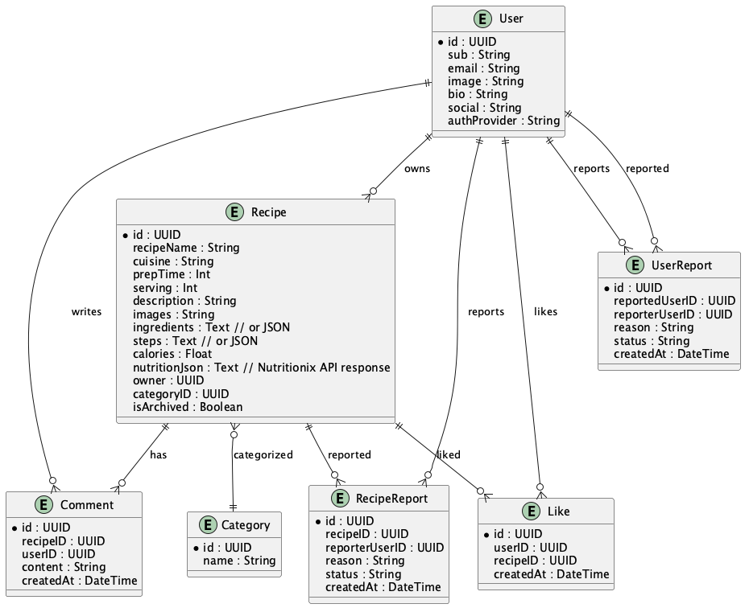

# GreenForked 🌱

> A modern vegan recipe platform for sharing, discovering, and engaging with plant-based recipes.

[](https://opensource.org/licenses/MIT)

---

## About GreenForked
GreenForked is a scalable, modern web application for vegan food lovers, bloggers, and the plant-based community. Users can upload, browse, like, and comment on vegan recipes, with a clean, mobile-friendly interface and robust backend.

---

## 🟢 Microservices Architecture
- **User Service**: Registration, Google OAuth, profile management, admin actions
- **Recipe Service**: Recipe CRUD, image upload, search/filter, reporting
- **Interaction Service**: Comments, likes, user engagement
- **Category Service**: Category management

---

## 🖥️ Tech Stack
- **Frontend**: React (TypeScript), Tailwind CSS, Google OAuth
- **Backend**: Spring Boot (Java 17+), PostgreSQL, REST APIs
- **Media Storage**: S3/Cloudinary (images only)
- **Deployment**: Docker, Kubernetes, GitHub Actions

---

## 🎨 Color Palette & Branding
- **Primary Green**: #2ecc71
- **Accent Green**: #27ae60
- **Background**: #ffffff
- **Text**: #222222
- **Subtle Gray**: #f7f7f7
- **CTA/Highlight**: #00b894
- **Error/Alert**: #e17055

---

## 🚀 Features
- Register/login with Google
- Create, edit, delete vegan recipes (images only)
- Browse, search, and filter recipes
- Like and comment on recipes
- User profiles with bio, image, social links
- Admin moderation (ban, warn, delete users/recipes)
- Report inappropriate recipes
- Category management

---

## 📦 Project Structure
```
GreenForked/
├── services/
│   ├── user-service/
│   ├── recipe-service/
│   ├── interaction-service/
│   └── category-service/
├── frontend/
├── deployment/
├── diagrams/
├── docs/
└── ...
```

---

## 📝 Documentation
- [Architecture & Use Cases](docs/architecture/ARCHITECTURE_DESCRIPTION.md)
- [Deployment Guide](docs/deployment/DEPLOYMENT_GUIDE.md)
- [Manual Test Procedure](docs/deployment/MANUAL_TEST_PROCEDURE.md)

---

## 🖼️ Key Diagrams

**Architecture Overview**


**Use Case Overview**


**ER Diagram**



---

## 🗂️ Contributing
- See [CONTRIBUTING.md](CONTRIBUTING.md) for guidelines
- Use the color palette and branding for all UI/UX

---

## 📄 License
MIT License – see [LICENSE](LICENSE)

---

*Built with ❤️ by the GreenForked community* 