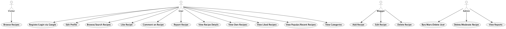

# GreenForked Documentation

Welcome to the documentation for GreenForked, the vegan recipe platform.

## Documentation Structure
- **Architecture**: System design, diagrams, and service breakdown
- **Deployment**: Guides for local and cloud deployment
- **Manual Testing**: Test procedures for all major features

## Key Docs
- [Architecture Description](architecture/ARCHITECTURE_DESCRIPTION.md)
- [Use Case Description](architecture/USE_CASE_DESCRIPTION.md)
- [Deployment Guide](deployment/DEPLOYMENT_GUIDE.md)
- [Manual Test Procedure](deployment/MANUAL_TEST_PROCEDURE.md)

## Color Palette
- Primary Green: #2ecc71
- Accent Green: #27ae60
- Background: #ffffff
- Text: #222222
- Subtle Gray: #f7f7f7
- CTA/Highlight: #00b894
- Error/Alert: #e17055

## 📚 Documentation Structure

### 🚀 [Deployment](./deployment/)
Deployment guides and setup instructions:
- [**Deployment Guide**](./deployment/DEPLOYMENT_GUIDE.md) - Complete deployment guide with GitHub Actions
- [**Shared Node Deployment**](./deployment/SHARED_NODE_DEPLOYMENT.md) - Cost-optimized single node setup
- [**Minimal Setup Guide**](./deployment/MINIMAL_SETUP_GUIDE.md) - Quick start for development
- [**Manual Test Procedure**](./deployment/MANUAL_TEST_PROCEDURE.md) - Step-by-step manual testing instructions

### 🏗️ [Architecture](./architecture/)
System architecture and design documentation:
- [**Architecture Description**](./architecture/ARCHITECTURE_DESCRIPTION.md) - System architecture overview
- [**Use Case Description**](./architecture/USE_CASE_DESCRIPTION.md) - Detailed use cases and workflows
- [**Diagrams README**](./architecture/DIAGRAMS_README.md) - Architecture diagrams and visualizations

### 💰 [Costs](./costs/)
Cost analysis and optimization:
- [**Cost Analysis**](./costs/COST_ANALYSIS.md) - Detailed cost breakdown for all deployment options

## 🎯 Quick Start

1. **New to GreenForked?** Start with the [Architecture Description](./architecture/ARCHITECTURE_DESCRIPTION.md)
2. **Ready to deploy?** Check the [Deployment Guide](./deployment/DEPLOYMENT_GUIDE.md)
3. **Cost conscious?** Review the [Cost Analysis](./costs/COST_ANALYSIS.md)
4. **Want to save money?** Use the [Shared Node Deployment](./deployment/SHARED_NODE_DEPLOYMENT.md)

## 📋 Documentation Guidelines

### Contributing to Documentation
- Keep documentation up to date with code changes
- Use clear, concise language
- Include code examples where helpful
- Add diagrams for complex concepts
- Test all commands and examples

### Documentation Standards
- Use consistent formatting and structure
- Include table of contents for long documents
- Cross-reference related documents
- Keep links updated when moving files

---

**Need help?** Check the main [README.md](../README.md) for quick start information or create an issue for documentation improvements.

## 🖼️ Key Diagrams

**Architecture Overview**

**Use Case Overview**

**ER Diagram**

--- 