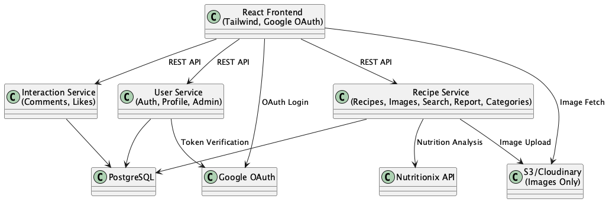
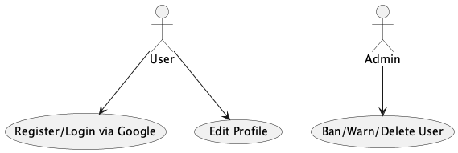
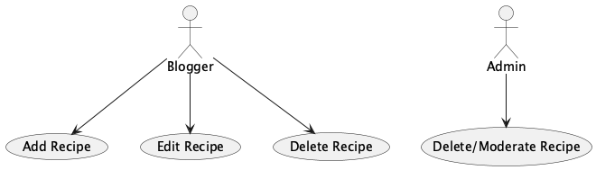
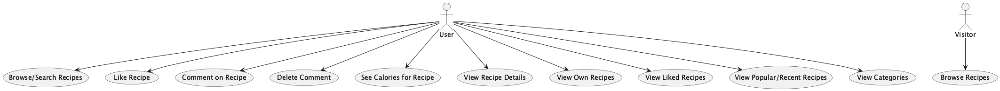
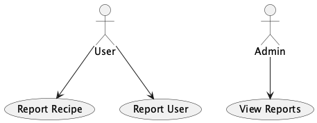
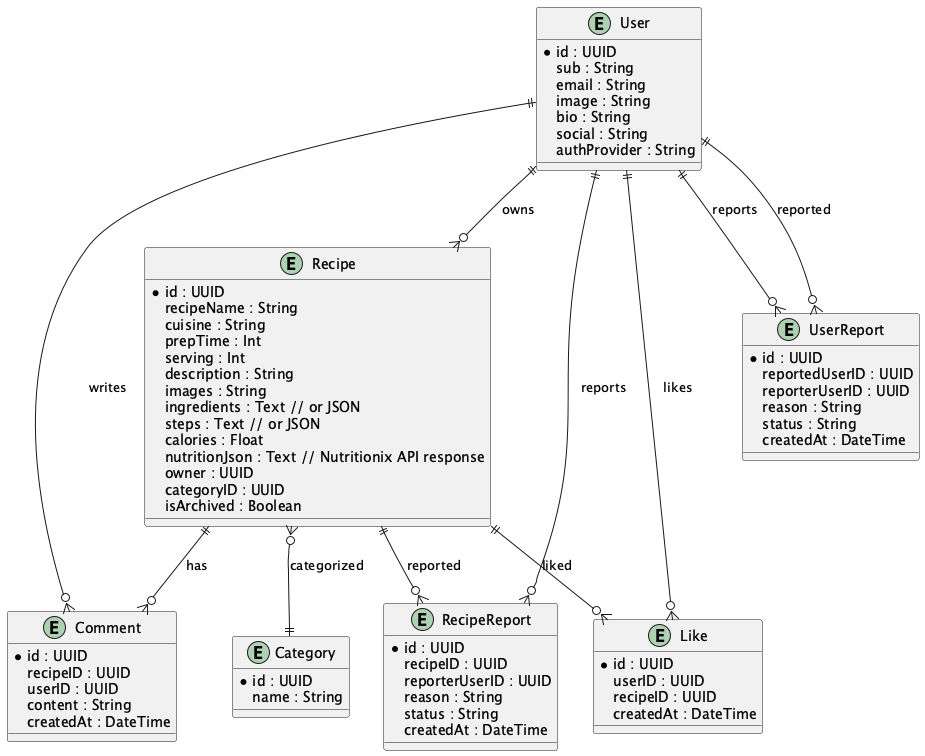

# GreenForked Architecture Description

## Overview
GreenForked is a microservices-based vegan recipe platform, designed for scalability, maintainability, and a modern user experience. The system uses a hybrid approach with both synchronous and asynchronous processing to optimize performance and user experience.

## Architecture Style
**Event-Driven Microservices** with **Message Queues** for asynchronous processing

## Core Microservices
- **User Service**: Handles authentication (Google OAuth), user registration, profile management, and admin actions.
- **Recipe Service**: Manages recipe CRUD, image uploads, search/filter, reporting, nutrition, and category management (recipes can be organized and filtered by category; admins can manage the list of categories).
- **Interaction Service**: Manages comments and likes on recipes.

## Asynchronous Processing Components

### Message Queue System
- **Redis**: Simple and fast message broker for asynchronous job processing
- **Benefits**: Decouples services, improves response times, enables scalability

### Background Workers
- **Image Processor**: Handles image resizing, optimization, and metadata extraction
- **Nutrition Worker**: Processes nutrition analysis via Nutritionix API
- **Search Indexer**: Updates Elasticsearch indices for recipe search
- **Notification Worker**: Handles email and push notifications
- **Moderation Worker**: Processes user/recipe reports and moderation tasks

## Data Storage
- **PostgreSQL**: Each service owns its tables.
- **Elasticsearch**: Dedicated search index for fast recipe search and filtering
- **Media Storage**: **Cloudflare Images** for all recipe/user images (no video support).
  - Predictable, low-cost pricing
  - Built-in CDN and image optimization
  - Direct upload API for user-generated content
  - No egress fees or bandwidth surprises
  - Easy integration with React/Spring Boot

## Frontend
- **React (TypeScript)**: Clean, green-themed UI inspired by Vegan Manna.
- **Tailwind CSS**: For rapid, consistent styling.

## Color Palette
- Primary Green: #2ecc71
- Accent Green: #27ae60
- Background: #ffffff
- Text: #222222
- Subtle Gray: #f7f7f7
- CTA/Highlight: #00b894
- Error/Alert: #e17055

## Synchronous vs Asynchronous Operations

### Synchronous (Immediate Response)
- User authentication and authorization
- Basic CRUD operations (create, read, update, delete)
- Real-time interactions (likes, comments)
- Image upload to Cloudflare (direct)
- Search queries (from indexed data)

### Asynchronous (Background Processing)
- **Image Processing**: Resize, optimize, extract metadata
- **Nutrition Analysis**: API calls to Nutritionix for calorie calculation
- **Search Indexing**: Update search indices when content changes
- **Notifications**: Email and push notifications for user activities
- **Moderation**: Processing reports and admin actions
- **Analytics**: User activity tracking and metrics

## Benefits of Queue-Based Architecture

### Performance
- **Faster Response Times**: Users get immediate feedback for actions
- **Better User Experience**: Non-blocking operations
- **Scalability**: Workers can be scaled independently

### Reliability
- **Fault Tolerance**: Failed jobs can be retried
- **Durability**: Jobs persist even if services restart
- **Monitoring**: Better visibility into background processes

### Maintainability
- **Service Decoupling**: Services don't depend on each other
- **Independent Scaling**: Scale workers based on load
- **Easier Testing**: Mock queue for testing

## Architecture Diagram
See [../../diagrams/architecture-overview.png](../../diagrams/architecture-overview.png)

## Use Case Diagrams
- [Authentication & User Management](../../diagrams/use-case-authentication.png)
- [Recipe Management](../../diagrams/use-case-recipe-management.png)
- [Social Features](../../diagrams/use-case-social-features.png)
- [Moderation & Reporting](../../diagrams/use-case-moderation.png)

## ER Diagram
See [../../diagrams/er-diagram.png](../../diagrams/er-diagram.png)

## 🖼️ Key Diagrams

**Architecture Overview**

**Use Case Diagrams**

Authentication & User Management:

Recipe Management:

Social Features:

Moderation & Reporting:

**ER Diagram**

 